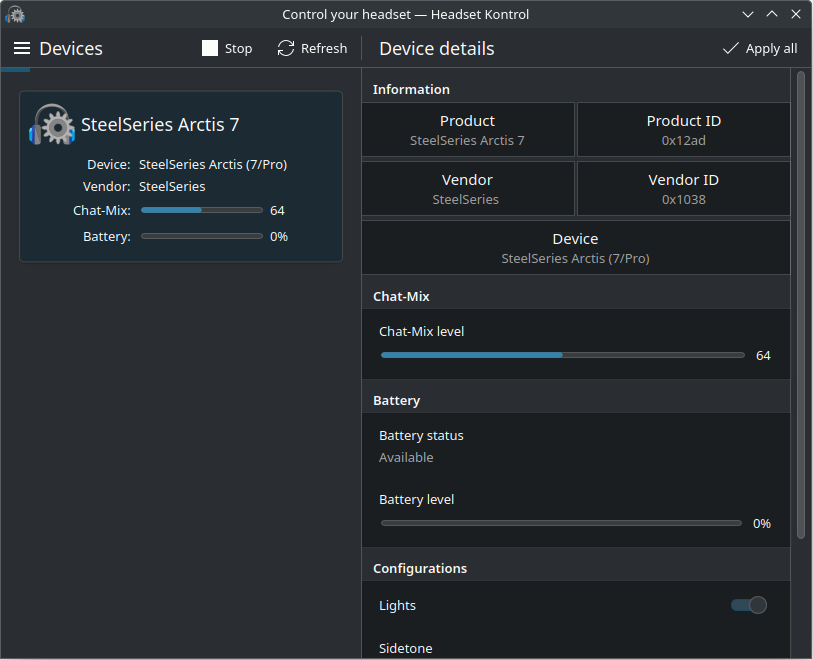

# HeadsetKontrol

Interface for [HeadsetControl](https://github.com/Sapd/HeadsetControl) written with Kirigami and KDE Framework.

* Monitor headsets information.
* Battery level notification.
* Set headsets specific settings.



## 1. Installing
1. Arch Linux

   HeadsetKontrol can be install from the [AUR](https://aur.archlinux.org/packages/headsetkontrol).

## 2. Building
### 2.1 Requirement
Qt version 6.5.0 or above with these modules:

* Core
* Gui
* Quick
* Qml
* QuickControls2
* Widgets
* DBus

KDE Framework 6.5.0 or above with these modules:

* ECM (for CMake)
* Kirigami
* KirigamiAddons (1.3.0 or newer)
* I18n
* CoreAddons
* Config
* DBusAddons
* Notifications
* IconThemes
* StatusNotifierItem
* XmlGui
* NotifyConfig

### 2.2 Installing dependencies

1. Arch Linux
```
pacman -Syu extra-cmake-modules kirigami kirigami-addons ki18n kcoreaddons kconfig kdbusaddons knotifications kiconthemes kstatusnotifieritem kxmlgui knotifyconfig
```

2. Fedora
```
dnf install extra-cmake-modules kf6-kirigami-devel kf6-kirigami-addons-devel kf6-ki18n-devel kf6-kcoreaddons-devel kf6-kconfig-devel kf6-kdbusaddons-devel kf6-knotifications-devel kf6-kiconthemes-devel kf6-kstatusnotifieritem-devel kf6-kxmlgui-devel kf6-knotifyconfig-devel
```

### 2.3 Build steps
- Create and enter build directory.

   ```
   mkdir build
   cd build
   ```

- Build the program.

   ```
   cmake -DCMAKE_INSTALL_PREFIX:PATH=install-prefix -DCMAKE_BUILD_TYPE=Release ..
   make
   ```

   > **NOTE**: `install-prefix` is denpendent on distro. For Arch Linux, it is `/usr`.

### 2.4 Install

   ```
   make install
   ```

### 2.5 Uninstall.
   ```
   make uninstall
   ```

## 3. Development

Feel free to report bugs and open pull request to any improvement. Do note that I am still learning and can be quite slow sometime.

[Translation progress](translation/Progress.md) can be view here. To add a new translation, copy the `template.pot` file and rename it to `<language>.po`. The language name must follow [i18n language codes](https://i18ns.com/languagecode.html).

## 4. License
The program is licensed under [GPL V3](LICENSE)
